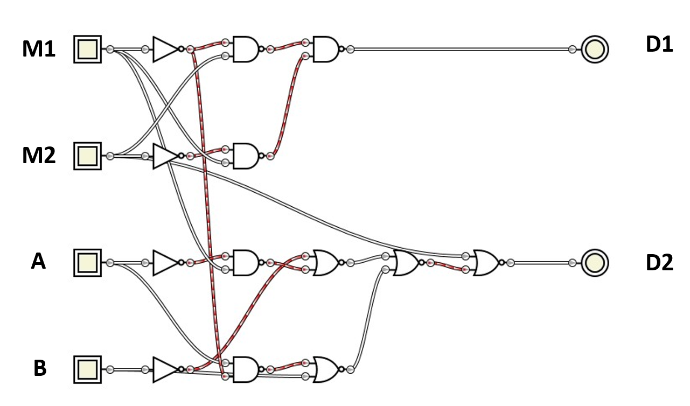
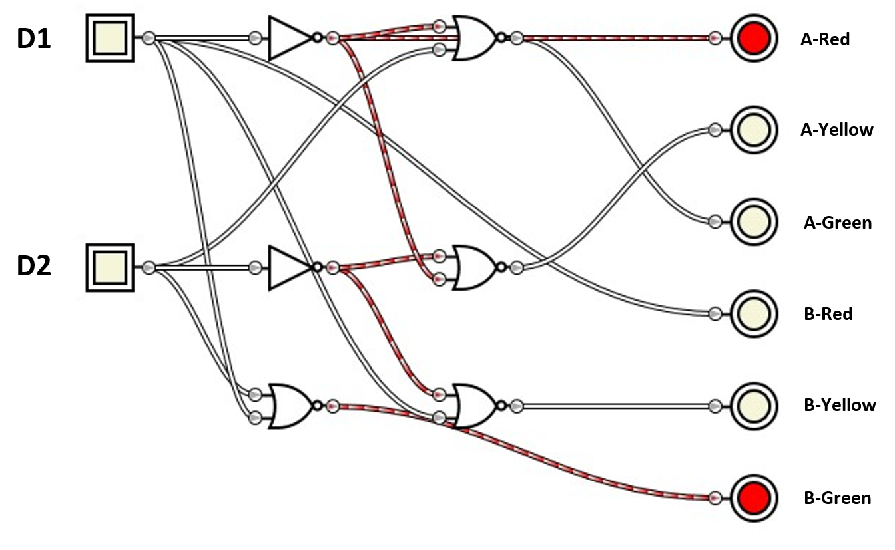
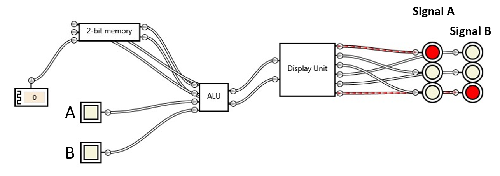

# Traffic Signal
A logic gate circuit simulating the traffic signals. [Logic Gate Simulator](https://sourceforge.net/projects/gatesim/) is used for the simulation of the project.

# ALU
After the memory we need an Arithmetic and Logic Unit (ALU) that will help us changing the signal by the input of sensors. Here is the logical diagram of the ALU used for this circuit. 

## Logic Equations
```
D1 = M1.M2' + M1'.M2
D2 = M1'.M2'.A.B' + M1.M2'.A'.B
```

# Display Unit
If we are making an embedded machine then we do not necessarily need a separate display unit. We, can simply program our ALU to do that for us. Anyhow, in our case, the display unit takes the new memory, that is processed in ALU first, and tells us which signals should be turned on. Here is the circuit used as the display unit. 

## Equations
```
A-Red     = D1'
A-Yellow  = D1.D2
A-Green   = D1.D2'
B-Red     = D1
B-Yellow  = D1'.D2
B-Green   = D1'.D2'
```

# Final Circuit
After finalizing the project the connections may look like this. And the accuracy of the circuit depends purely upon the clock syncing. If the clock is not synced within the time that just reads, processes and rewrites the memory, circuit will not function properly. The finalized circuit with clock input looks like this when in default state. 

# How to use
Just download [Logic Gate Simulator](https://sourceforge.net/projects/gatesim/) and run [main.gcg](main.gcg) file. 
